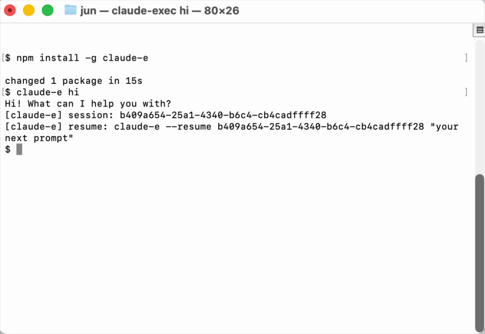

# claude-e

[](https://github.com/lidge-jun/claude-e/actions/workflows/test.yml)
[](https://www.npmjs.com/package/claude-e)
[](LICENSE)
[](Cargo.toml)



`claude-e` is a PTY-backed execution wrapper for Claude Code.

It gives Claude a `claude -p`-style command surface while still driving the
interactive Claude Code runtime underneath. That matters when an agent system
needs the real interactive Claude behavior, but also needs a predictable
single-command interface, JSON output, timeouts, resume wiring, and explicit
binary resolution.

```bash
npm install -g claude-e

claude-e "your prompt here"
claude-e p --model opus "explain quicksort to a 10-year-old"
claude-e --tool "use 10 tools and summarize the results"
claude-e --output-format json "summarize this commit" < commit.diff
claude-e --output-format stream-json "audit src/" --verbose | jq .
```

## Why This Exists

Claude Code is strongest as an interactive tool. Agent runtimes often need the
opposite shape: spawn one process, send one prompt, collect structured output,
classify failures, and move on.

`claude-e` bridges that gap:

| Need | What `claude-e` does |
|---|---|
| `claude -p`-like usage | Accepts prompt args, piped stdin, `p` / `print`, `-p`, and `--print`. |
| Real Claude Code behavior | Uses a PTY and injects the prompt through the interactive path. |
| Agent-friendly output | Normalizes transcript replay into `text`, `json`, or `stream-json`. |
| Embedding stability | Supports `run` / `exec`, JSONL runtime events, timeout exit codes, and resume. |
| Launchd/server safety | Lets callers pass an explicit `--claude-bin` instead of relying on PATH. |
| Unattended tools | Enables Claude permission bypass and workspace/folder trust handling by default. |
| Terminal progress | `--tool`, `--t`, or `-t` prints compact tool-use lines on stderr. |
| cli-jaw migration | Keeps `claude-exec`, `claude-i`, and `jaw-claude-i` compatibility bins. |

## Install

```bash
npm install -g claude-e
```

After installation, the CLI is available directly:

```bash
claude-e "your prompt here"
claude-e --tool "use 10 tools"
claude-e --help
```

Optional one-shot usage without a global install:

```bash
npx claude-e "your prompt here"
```

From source:

```bash
git clone https://github.com/lidge-jun/claude-e.git
cd claude-e
npm install
cargo build --release --locked
```

The npm package builds the Rust release binary during `postinstall`. Set
`CLAUDE_EXEC_SKIP_BUILD=1` only when another packaging layer provides the binary.

## Command Surface

The short command is the public face:

```bash
claude-e "your prompt here"
claude-e p "your prompt here"
claude-e print "your prompt here"
claude-e -p "your prompt here"
```

The long command remains available for compatibility:

```bash
claude-exec "your prompt here"
claude-exec run --claude-bin "$(command -v claude)" -- --model opus
claude-exec exec --claude-bin "$(command -v claude)" -- --model opus
```

The package currently exposes four bins from the same Rust entrypoint:

| Bin | Status | Purpose |
|---|---|---|
| `claude-e` | Primary | Short npm command and `claude -p`-style surface. |
| `claude-exec` | Compatibility | Long descriptive alias retained for existing integrations. |
| `claude-i` | Transitional | Existing cli-jaw provider/runtime compatibility. |
| `jaw-claude-i` | Legacy | Existing cli-jaw helper name compatibility. |

## Print-Compatible Examples

Plain text:

```bash
claude-e "write a two-line commit summary"
```

Terminal tool progress:

```bash
claude-e --tool "use 10 tools and summarize what happened"
claude-e --t --model opus "inspect this repo with tools"
```

`--tool` / `--t` / `-t` prints compact `tool_use` and `tool_result` progress
lines to stderr. Stdout stays reserved for the final answer or selected output
format, so pipes and JSON consumers are not broken.

JSON result:

```bash
git diff --cached | claude-e --output-format json "summarize this staged diff"
```

Stream JSON:

```bash
claude-e --output-format stream-json "audit src/" --verbose | jq .
```

For streaming UIs, prefer `--output-format stream-json`. It preserves the
Claude-like assistant/user records, including tool calls, tool results, and the
final synthesized result event.

Explicit Claude binary:

```bash
CLAUDE_EXEC_CLAUDE_BIN="$(command -v claude)" \
  claude-e --model opus "explain this repo architecture"
```

Session-shaped run:

```bash
claude-e \
  --session-id 00000000-0000-4000-8000-000000000001 \
  --output-format stream-json \
  "continue this investigation from the existing Claude session"
```

Every print-compatible run tracks the Claude session id. In text mode,
`claude-e` prints a resume footer to stderr:

```text
[claude-e] session: 6a304357-e92d-47e7-a56d-c54065e12be1
[claude-e] resume: claude-e --resume 6a304357-e92d-47e7-a56d-c54065e12be1 "your next prompt"
```

Resume with:

```bash
claude-e --resume 6a304357-e92d-47e7-a56d-c54065e12be1 "continue from there"
```

Use `--no-session-footer` when the terminal footer is not wanted.

## PTY Runtime Mode

Agent systems can use the explicit runtime command:

```bash
printf 'Say hello in one short sentence.\n' \
  | claude-e run \
      --jsonl \
      --output-format stream-json \
      --timeout-ms 600000 \
      --claude-bin "$(command -v claude)" \
      -- \
      --model claude-opus-4-6
```

`exec` is a visible alias for `run`:

```bash
printf 'Say hello.\n' \
  | claude-e exec --claude-bin "$(command -v claude)" -- --model opus
```

## Supported Flags

Wrapper-owned flags:

| Flag | Behavior |
|---|---|
| `--input-format text\|stream-json` | Reads plain stdin or extracts user text from JSONL messages. |
| `--output-format text\|json\|stream-json` | Selects transcript output normalization. |
| `--timeout-ms` | Runtime timeout in milliseconds. |
| `--claude-bin` | Claude CLI binary or absolute path. |
| `--cwd` | Working directory for the Claude PTY process. |
| `--cols`, `--rows` | PTY dimensions. |
| `--session-id` | Uses a specific session id in print-compatible mode. |
| `--resume`, `-r` | Resumes a Claude session in the PTY path. |
| `--no-session-persistence` | Suppresses generated session ids. |
| `--json-schema` | Appends a JSON-only schema instruction to the prompt. |
| `--auto-accept-workspace-trust` | Accepts Claude's pre-SessionStart workspace/folder trust prompt. Enabled by default. |
| `--no-auto-accept-workspace-trust` | Disables automatic workspace/folder trust handling in print-compatible mode. |
| `--tool`, `--t`, `-t` | Prints compact terminal tool progress to stderr. |
| `--no-session-footer` | Hides the final stderr resume footer in print-compatible mode. |

Forwarded Claude flags include `--model`, `--effort`, `--permission-mode`,
`--add-dir`, `--allowed-tools`, `--disallowed-tools`, `--tools`, `--mcp-config`,
`--settings`, `--system-prompt`, `--append-system-prompt`, `--plugin-dir`,
`--plugin-url`, browser flags, MCP debug flags, and related Claude global
controls.

Print-only compatibility flags such as `--verbose`,
`--include-partial-messages`, `--include-hook-events`,
`--replay-user-messages`, `--fallback-model`, and `--max-budget-usd` are
accepted so command shapes port cleanly from print-mode Claude.

Unless the caller already supplied `--permission-mode`,
`--permission-mode=...`, `--dangerously-skip-permissions`, or
`--allow-dangerously-skip-permissions`, `claude-e` appends
`--dangerously-skip-permissions` to the underlying Claude invocation. This keeps
non-interactive tool use from hanging on permission prompts.

## Output Contract

Default print-compatible mode suppresses wrapper diagnostics from stdout and
returns the requested user-facing format.

Explicit `run` / `exec` mode emits JSONL. Runtime lifecycle records use the
existing cli-jaw compatibility envelope:

```json
{"type":"jaw_runtime","event":"runtime_started","runId":"run_12345678"}
```

Claude transcript records are tailed and normalized into Claude-like stream JSON.
On completion, the wrapper can synthesize a result record from the last assistant
message.

## Exit Codes

| Code | Meaning |
|---:|---|
| `0` | Normal completion. |
| `1` | Underlying Claude exited unsuccessfully without a more specific wrapper classification. |
| `2` | Graceful interrupt; session metadata can be resumable. |
| `4` | Claude spawn or PTY write failure. |
| `5` | SessionStart hook failure, timeout, or early Claude exit before SessionStart. |
| `6` | Runtime timeout. |
| `7` | Prompt injection transcript verification failure. |
| `11` | Claude StopFailure hook. |
| `13` | Hook temp dir or settings generation failure. |
| `16` | stdin read, size, empty prompt, or prompt sanitization failure. |

## Development

```bash
npm run fmt:check
npm run test
npm run build
npm run verify
```

Smoke test with local Claude auth:

```bash
bash scripts/smoke.sh
```

## Release

Dry-run the exact npm publish surface:

```bash
npm run publish:dry-run
```

Release helpers:

```bash
npm run release:check   # full local release dry run
npm run release:npm     # publish the current package version
npm run release:patch   # bump patch, commit, tag, publish, create GitHub Release
npm run release:minor   # bump minor, commit, tag, publish, create GitHub Release
npm run release:major   # bump major, commit, tag, publish, create GitHub Release
npm run release:preview # publish preview dist-tag prerelease
```

GitHub Actions only runs Rust verification and npm dry-runs. Actual npm
publishing is intentionally local-only: run `npm run release:npm` for the
current version or a semver release helper when you explicitly want to publish.
When npm is not authenticated, the release scripts start `npm login
--auth-type=web` so npm can use its normal browser login flow in your local
terminal before publishing.

## Architecture Docs

- [structure/INDEX.md](structure/INDEX.md)
- [structure/cli_surface.md](structure/cli_surface.md)
- [structure/runtime_contract.md](structure/runtime_contract.md)
- [structure/cli_jaw_migration.md](structure/cli_jaw_migration.md)
- [devlog/_plan/260516_claude_exec_extraction/00_overview.md](devlog/_plan/260516_claude_exec_extraction/00_overview.md)

## License

MIT
